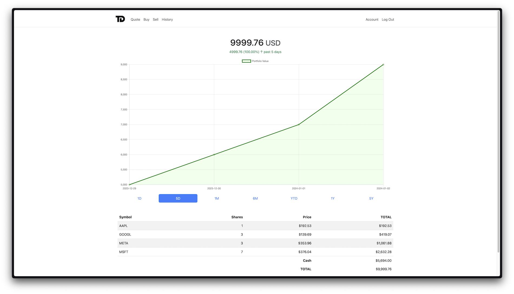

<p align="center">
    
</p>

# Trading Demo

[**Trading Demo**](https://tradingdemo.vercel.app/) is a paper trading app via which you can monitor live stock prices and make informed decisions for portfolio growth. Building upon CS50's Problem Set 9: Finance, Trading Demo comes with brand new features including an interactive graph with historical data.

[](https://tradingdemo.vercel.app/)

## Features

- **Real-Time Market Data:** Access to real-time stock prices via the Yahoo Finance API.
- **Performance Analytics:** An interactive chart to track gains and losses over standard timescales, allowing users to monitor their overall performance.
- **Secure Online Storage:** Trading Demo uses a range of security measures for online data storage such as password hashing and session tokens, enabling users to securely access their Trading Demo accounts anywhere.

## Design & Architecture

### Object-Oriented Design

I applied object-oriented design principles to improve code organization, readability, and maintainability. 

The `Timescale` class defined in `helpers.py` is designed to manage different time intervals used within the application. It provides a convenient way to define and retrieve time-related parameters. This class initializes a dictionary, `timescale`, with keys representing different time intervals (e.g., "1D" for one day, "1M" for one month) and corresponding values representing the number of days in each interval.

```python
class Timescale:
    def __init__(self):
        self.timescale = {
            "1D": 1,
            "5D": 5,
            "1M": 30,
            "6M": 180,
            "YTD": (datetime.now() - datetime(datetime.now().year, 1, 1)).days,
            "1Y": 365,
            "5Y": 5 * 365,
        }

    def get_keys(self):
        keys = list(self.timescale.keys())
        return keys

    def get_value(self, key):
        num_days = self.timescale.get(key)
        date = datetime.now() - timedelta(days=num_days)
        return date
```

The `Timescale()` class serves as a compact repository for handling time intervals, adopting a modular approach by bundling related functionalities into one class. By encapsulating both the timescale dictionary and its associated methods, I ensure adherence to the encapsulation principle, enabling the abstraction of time-related functionalities. Additionally, I've designed the class to provide a straightforward interface for obtaining keys, values, and date references, promoting a clean separation of concerns. 

The `Database()` class in `helpers.py` encapsulates the interaction with the database, utilizing CS50's `SQL` module. It includes methods to perform various database operations, such as retrieving user information, updating portfolios, managing historical data, and handling user authentication.

```python
class Database:
    def __init__(self):
        self.db = SQL(postgres_url + "?sslmode=require")

    # ... (methods for user-related queries, portfolio operations, and historical data)

    def get_total(self):
        rows = self.get_portfolio()
        column = self.get_cash()

        for row in rows:
            row["price"] = lookup(row["symbol"])["price"]
            row["total"] = row["price"] * row["shares"]
            column += row["total"]
        return column
```

The `Database()` class provides an abstraction layer for database operations, enhancing modularity and maintainability. It encapsulates SQL queries, making it easier to manage changes in the database schema or switch to a different database system in the future. Moreover, the class strictly adheres to the single responsibility principle by focusing solely on database-related functionalities, ultimately contributing to a more maintainable and comprehensible codebase. 

### Dynamic Data Rendering

I incorporated dynamic data rendering to enhance the user experience without the need for complete page reloads. 

The `get_timescale()` route defined in `app.py` returns data intended for processing with JavaScript. This facilitates the dynamic fetching and updating of time-sensitive data associated with the user's portfolio. The asynchronous data retrieval allows for real-time updates on the client side, ensuring that users receive the most current information without disrupting their overall interaction with the application. 

```python
@app.route('/timescale', methods=['GET'])
@login_required
def get_timescale():
    tab = request.args.get("tab")
    totals_history = db.get_totals_history(tab)
    gain_loss, percent_change = db.get_totals_difference(tab)
    data = {}
    chart_data = {}

    for date, balance in totals_history.items():
        chart_data[date] = balance

    data[tab] = {
        "gain_loss": gain_loss,
        "percent_change": percent_change,
        "chart_data": chart_data
    }

    return data
```

```javascript
function updateTab(tab) {
    showLoader(tab);
    var xhr = new XMLHttpRequest();
    xhr.open("GET", "/timescale?tab=" + tab, true);
    xhr.onreadystatechange = function () {
        if (xhr.readyState == 4 && xhr.status == 200) {
            hideLoader(tab);
            var data = JSON.parse(xhr.responseText);
            var gainLoss = data[tab].gain_loss.toFixed(2);
            var percentChange = data[tab].percent_change.toFixed(2);
            var chartData = data[tab].chart_data;
```

The utilization of asynchronous data fetching aligns with modern web development practices, offering a more responsive and interactive interface. This dynamic data approach contributes to a smoother user experience, providing users with up-to-date financial information and facilitating a more engaging and efficient interaction with Trading Demo.

## Recommendations for Future Development

- **Performance Analytics for Individual Shares:** Currently, the performance analytics feature only tracks the overall performance of the user's portfolio. In the future, I plan to add a similar feature for individual shares, allowing users to monitor the performance of their holdings over time.
- **Improved Data Source:** The Yahoo Finance API is no longer accessible to new users. Moreover, it has a limited number of endpoints and does not provide access crucial data such as EPS and P/E ratios. In the future, I plan to switch to a more robust API, such as the one from [Financial Modeling Prep](https://site.financialmodelingprep.com/developer/docs), which offers a wider range of endpoints and more comprehensive data.
- **Additional Features:** I plan to add more features to Trading Demo, including a feed for aggregating financial news, a watchlist, and a leaderboard. These features will enhance the user experience and provide users with more opportunities to explore financial data and learn about investment strategies.